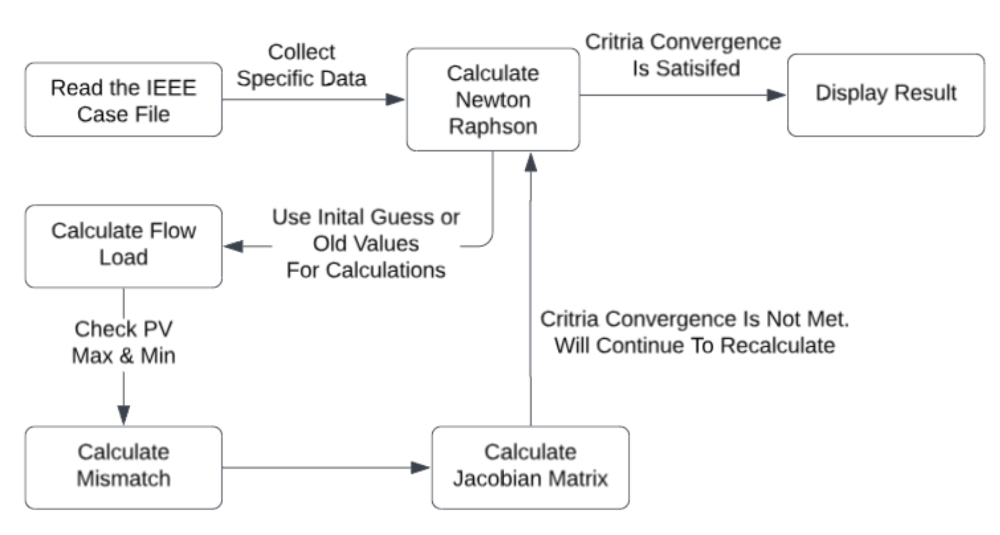

# Newton-Raphson Power Flow Analysis  

This repository contains a **Python** implementation of the **Newton-Raphson (NR) power flow analysis**. The program takes input from the **[IEEE Power Flow Test Cases](https://lamarr.ece.uw.edu/research/pstca)** and computes key power flow results, including:  
- **Bus Voltage Magnitudes & Angles**  
- **Generator Outputs**  
- **Line Power Flows**  

## Newton-Raphson Flowchart  

Below is the flowchart illustrating the Newton-Raphson power flow calculation process:  

  

## Future Improvements  
Planned enhancements for the next versions:  
- Improve **Jacobian Matrix** computation for better efficiency  
- Enhance **Q-limits enforcement** for generators  
- Include **shunt susceptance** at specific buses  
- Implement **transformer phase shift angles**
- 
## Liscence
This project is open-source! Feel free to fork the repository and contribute improvements. 

##  Prerequisites  
Ensure you have **Python 3.x** installed along with the required libraries:  
```bash
pip install numpy


